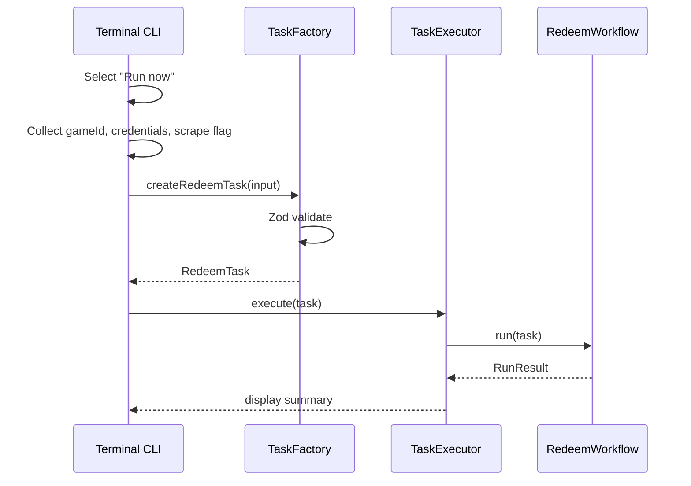
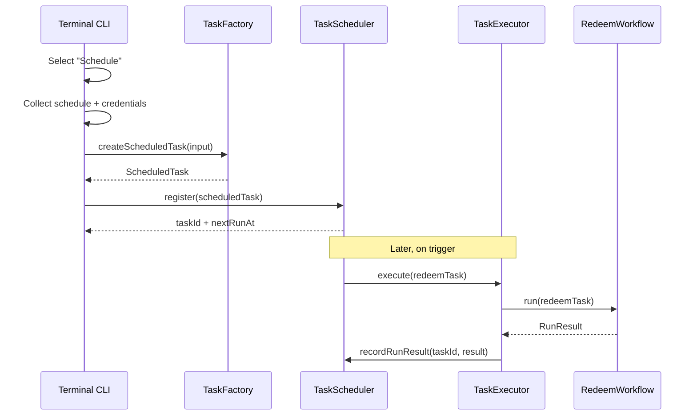
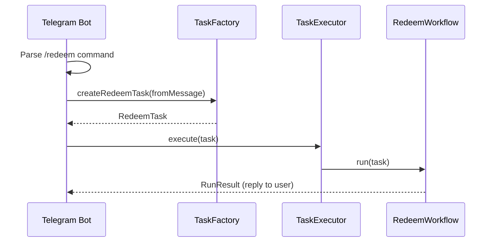

# Auto Code Redeemer v2 — Implementation Plan

> See **[AGENTS.md](./AGENTS.md)** for conventions, stack, and agent rules.

## Phases 1–6b ✅ COMPLETE

---

## Phase 7 — Event-Driven Architecture Redesign ⏳ NOT STARTED

> **Goal:** Replace manual vs cron branching with a single execution pipeline. All input sources (CLI, scheduler, future Telegram/API/web) produce the same `RedeemTask` and submit it to the same executor. The redeem workflow must not know or care how it was triggered.

> **Zero-legacy rule:** Phase 7 is **not complete** until every file, folder, function, type, env var, npm script, and doc reference from the old manual/cron architecture is **deleted or rewritten**. No shims, no `@deprecated` re-exports, no “temporary” adapters left behind. If something is replaced, the old symbol must be gone in the same PR (or the immediately following cleanup PR before phase sign-off).

### Problem statement (current architecture)

| Issue | Where it lives today |
|-------|----------------------|
| Separate commands (`npm run start` vs `npm run cron`) | `package.json` |
| `EXECUTION_MODE` if/else branching | `index.ts`, `orchestrator.ts`, `scrapeGate.ts` |
| `manualInput \| null` encodes mode implicitly | `orchestrator.ts` |
| Game ID + credentials in `.env` | `env.ts`, per-game `credentials.ts` |
| Scrape policy mixed with execution mode | `scrapeGate.ts` |
| CLI coupled to lifecycle shutdown | `lifecycle.ts` → `prompts.ts` |
| Storage path tied to env cache | `codeStore.ts` → `getEnv()` |

### High-level architecture

```text
┌─────────────────────────────────────────────────────────────────┐
│                        INPUT ADAPTERS                           │
│  Terminal CLI  │  Scheduler  │  Telegram  │  REST API  │ Web  │
└────────┬───────────────┬──────────────┬───────────┬──────────────┘
         │               │              │           │
         └───────────────┴──────────────┴───────────┘
                                 │
                                 ▼
                    ┌────────────────────────┐
                    │   TaskFactory / DTO    │
                    │   validates + builds   │
                    │   RedeemTask           │
                    └───────────┬────────────┘
                                │
              ┌─────────────────┴─────────────────┐
              │                                   │
              ▼                                   ▼
   ┌──────────────────────┐         ┌──────────────────────┐
   │  TaskScheduler       │         │  TaskExecutor        │
   │  (optional — defers   │         │  (immediate run)     │
   │   execution)         │         │                      │
   └──────────┬───────────┘         └──────────┬───────────┘
              │ on trigger                      │
              └─────────────────┬───────────────┘
                                ▼
                    ┌────────────────────────┐
                    │   RedeemWorkflow       │
                    │   scrape → redeem      │
                    │   (mode-agnostic)      │
                    └────────────────────────┘
```

**Design rule:** Input adapters only collect/validate data and create tasks. `RedeemWorkflow` is the only place redeem logic runs.

---

### Event flow diagrams

#### Run now (terminal)



#### Schedule (terminal)



#### Future Telegram bot



---

### Target folder structure

```text
src/
├── index.ts                      # bootstrap only — wires DI, starts adapters
├── config/
│   ├── loadEnv.ts                # dotenv
│   ├── appConfig.ts              # app-level env ONLY (no credentials/game)
│   └── constants.ts
├── domain/                       # pure domain models + validation schemas
│   ├── task/
│   │   ├── redeemTask.ts         # RedeemTask, ScrapePolicy
│   │   ├── scheduledTask.ts      # ScheduledTask, ScheduleSpec
│   │   └── taskSchemas.ts        # Zod schemas
│   ├── credentials/
│   │   └── gameCredentials.ts    # per-game credential shapes
│   └── result/
│       └── runResult.ts          # RunSummary, RedeemSummary
├── application/                  # use cases / orchestration
│   ├── taskFactory.ts            # builds + validates tasks from raw input
│   ├── taskExecutor.ts           # single entry: execute(RedeemTask)
│   ├── redeemWorkflow.ts         # scrape → redeem (replaces orchestrator)
│   └── scrapePolicy.ts           # replaces scrapeGate — policy on task, not mode
├── scheduling/
│   ├── scheduler.ts              # Scheduler interface
│   ├── scheduleSpec.ts           # once | daily | interval | weekdays | cron
│   ├── inMemoryScheduler.ts      # dev / tests
│   └── persistedScheduler.ts     # SQLite/Postgres-backed (production)
├── infrastructure/               # IO implementations
│   ├── storage/
│   │   ├── codeStore.ts
│   │   ├── taskStore.ts          # persist scheduled tasks
│   │   └── codeStorePath.ts
│   ├── browser/
│   │   ├── chromeLauncher.ts
│   │   ├── lifecycle.ts
│   │   └── pageActions.ts
│   └── events/
│       └── eventBus.ts           # optional — run lifecycle hooks
├── games/                        # unchanged plug-in pattern
│   ├── registry.ts
│   ├── genshin/
│   └── hsr/
├── adapters/                     # input sources — thin wrappers only
│   ├── cli/
│   │   ├── cliApp.ts             # main terminal loop
│   │   ├── runNowFlow.ts
│   │   ├── scheduleFlow.ts
│   │   └── prompts.ts
│   ├── telegram/                 # Phase 2 — stub initially
│   │   └── telegramBot.ts
│   ├── api/                      # Phase 3 — stub initially
│   │   └── routes.ts
│   └── web/                      # Phase 4 — stub initially
│       └── dashboard.ts
├── services/                     # domain services (scrape, redeem helpers)
│   ├── scrapeService.ts
│   └── redemptionService.ts
├── types/                        # shared TS interfaces (re-export domain where needed)
└── utils/
```

**Folders removed after migration (delete entirely if empty):**
- `src/core/` — only `errors.ts` moves to `domain/` or `infrastructure/`; delete `orchestrator.ts` then folder if nothing left
- `src/cli/` — replaced by `adapters/cli/`; delete whole folder after move

---

### Zero-legacy cleanup policy

Apply on **every refactoring step**, not only at the end. When adding a replacement, delete the original in the same change set.

#### Must delete — files

| Delete | Replaced by |
|--------|-------------|
| `src/core/orchestrator.ts` | `src/application/redeemWorkflow.ts` |
| `src/cli/manualFlow.ts` | `src/adapters/cli/runNowFlow.ts` |
| `src/services/scrapeGate.ts` | `src/application/scrapePolicy.ts` |
| `src/config/env.ts` | `src/config/appConfig.ts` |
| `src/types/orchestrator.ts` | `src/domain/result/runResult.ts` (+ task types in `domain/task/`) |
| `src/types/env.ts` (`AppEnv`, `GetEnvOptions`) | `src/config/appConfig.ts` types |

#### Must delete — exports / symbols

| Symbol | Location today |
|--------|----------------|
| `runOrchestrator` | `src/core/orchestrator.ts` |
| `collectManualRunInput` | `src/cli/manualFlow.ts` |
| `resolveScrapeGate` | `src/services/scrapeGate.ts` |
| `peekExecutionMode` | `src/config/env.ts` |
| `getEnv` / `getEnv({ gameId })` | `src/config/env.ts` |
| `ExecutionMode`, `ExecutionModeValue` | `src/config/constants.ts` |
| `ManualRunInput` | `src/types/orchestrator.ts` |
| `ResolveScrapeGateOptions`, `ScrapeGateResult` | `src/types/services.ts` |
| `AppEnv`, `GetEnvOptions` | `src/types/env.ts` |
| `parseCredentials` from env at startup | per-game `credentials.ts` — call only from `TaskFactory` |
| `gameModule.parseCredentials(process.env)` in `getEnv()` | removed; credentials come from task input |

#### Must delete — env vars & npm scripts

| Remove | Notes |
|--------|-------|
| `EXECUTION_MODE` | No manual/cron mode switch |
| `GAME_ID` | Game lives on `RedeemTask` |
| `GENSHIN_*` / `HSR_*` in `.env` | Credentials live on task / DB |
| `npm run cron` / `cron:prod` | Single `npm start`; scheduler is in-app |
| `cross-env EXECUTION_MODE=...` | Remove from `package.json` |

#### Must update — docs & config templates

| File | Action |
|------|--------|
| `AGENTS.md` | Remove manual/cron table, `orchestrator` paths, `GAME_ID` / credential env docs |
| `.env.example` | App config only; strip game credential blocks |
| `PLAN.md` | Mark Phase 7 complete only after legacy audit passes |
| `README.md` (if present) | Single entry point + schedule docs |

#### Per-step cleanup rule

At the end of each refactoring step, run the **legacy audit** (below). Do not start the next step while forbidden symbols still exist — except Step 1 may keep a thin bridge only until Step 3 lands, then the bridge must be deleted before Step 4.

#### Phase 7 completion gate — legacy audit

Phase 7 cannot be marked ✅ until all checks pass:

```bash
# 1. No forbidden symbols in src/ (expect zero matches)
rg -n "ExecutionMode|runOrchestrator|collectManualRunInput|resolveScrapeGate|peekExecutionMode|ManualRunInput|manualShouldScrape|GetEnvOptions|AppEnv|EXECUTION_MODE" src/

# 2. No old paths
rg -n "core/orchestrator|cli/manualFlow|services/scrapeGate|config/env" src/ AGENTS.md .env.example package.json

# 3. Build + typecheck clean
npm run build && npm run typecheck

# 4. No orphan folders
test ! -f src/core/orchestrator.ts
test ! -f src/cli/manualFlow.ts
test ! -f src/services/scrapeGate.ts
```

Manual review checklist:
- [ ] No commented-out old code “for reference”
- [ ] No unused imports or dead exports (`tsc` strict + visual grep)
- [ ] No duplicate types (e.g. both `RunSummary` and `RunResult` without migration)
- [ ] Game modules: `requiredEnvVars` / env-based credential parsing removed or scoped to `TaskFactory` only
- [ ] `codeStore.ts` does not import `getEnv()`
- [ ] `package.json` has no `cron` scripts
- [ ] `.env.example` has no game credentials or `GAME_ID`

---

### Core domain models

```typescript
// domain/task/redeemTask.ts

export type ScrapePolicy =
  | { type: "always" }
  | { type: "never" }
  | { type: "ifNotScrapedToday" };   // replaces cron daily gate

export interface RedeemTask {
  readonly id: string;
  readonly gameId: GameIdValue;
  readonly credentials: GameLoginCredentials;
  readonly scrapePolicy: ScrapePolicy;
  readonly source: TaskSource;        // "cli" | "scheduler" | "telegram" | "api" | "web"
  readonly createdAt: string;
  readonly metadata?: Record<string, string>;
}

export interface ScheduledTask {
  readonly id: string;
  readonly redeemTask: Omit<RedeemTask, "id">;  // template
  readonly schedule: ScheduleSpec;
  readonly enabled: boolean;
  readonly lastRunAt: string | null;
  readonly nextRunAt: string | null;
}
```

```typescript
// scheduling/scheduleSpec.ts

export type ScheduleSpec =
  | { type: "once"; at: string }                    // ISO datetime
  | { type: "daily"; at: string }                   // HH:mm
  | { type: "intervalHours"; every: number }
  | { type: "intervalMinutes"; every: number }
  | { type: "weekdays"; days: number[]; at: string } // 0=Sun … 6=Sat
  | { type: "cron"; expression: string };            // standard cron
```

```typescript
// domain/result/runResult.ts

export interface RunResult {
  readonly taskId: string;
  readonly status: "success" | "partial" | "failed";
  readonly scraped: boolean;
  readonly scrapeStats: ScrapeStats | null;
  readonly redeemSummary: RedeemSummary | null;
  readonly startedAt: string;
  readonly finishedAt: string;
  readonly error?: string;
}
```

---

### Job / task abstraction

**Command pattern** — `RedeemTask` is the command; `TaskExecutor` is the invoker; `RedeemWorkflow` is the receiver.

```typescript
// application/taskExecutor.ts

export interface TaskExecutor {
  execute(options: ExecuteTaskOptions): Promise<RunResult>;
}

export interface ExecuteTaskOptions {
  task: RedeemTask;
  onProgress?: (event: WorkflowEvent) => void;
}
```

```typescript
// application/redeemWorkflow.ts

export interface RedeemWorkflow {
  run(options: RunWorkflowOptions): Promise<RunResult>;
}

export interface RunWorkflowOptions {
  task: RedeemTask;
  chrome: ChromeEnvConfig;          // from app config, not task
  codeStoreBasePath: string;        // from app config
}
```

**Key rule:** `RedeemWorkflow.run()` receives a fully-formed `RedeemTask`. No `manualInput | null`, no `executionMode` checks.

**Scrape policy lives on the task**, not on execution mode:

| Source | Typical `scrapePolicy` |
|--------|------------------------|
| CLI "Run now" + user says yes | `{ type: "always" }` |
| CLI "Run now" + user says no | `{ type: "never" }` |
| Scheduled task | `{ type: "ifNotScrapedToday" }` |
| API force-scrape | `{ type: "always" }` |

```typescript
// application/scrapePolicy.ts

export function shouldScrape(
  options: ShouldScrapeOptions,
): Promise<boolean> {
  const { policy, gameId, codeStoreBasePath } = options;
  switch (policy.type) {
    case "always": return Promise.resolve(true);
    case "never": return Promise.resolve(false);
    case "ifNotScrapedToday":
      return hasScrapedToday({ gameId, codeStoreBasePath });
  }
}
```

---

### Scheduler abstraction

**Strategy pattern** — pluggable scheduler backends; same interface for in-memory (dev), SQLite (single-node), Postgres (multi-instance).

```typescript
// scheduling/scheduler.ts

export interface TaskScheduler {
  register(options: RegisterScheduleOptions): Promise<ScheduledTask>;
  cancel(taskId: string): Promise<void>;
  list(): Promise<ScheduledTask[]>;
  start(): Promise<void>;   // begins polling / cron tick loop
  stop(): Promise<void>;
}

export interface RegisterScheduleOptions {
  redeemTask: Omit<RedeemTask, "id" | "createdAt" | "source">;
  schedule: ScheduleSpec;
}
```

**Implementation notes:**
- `InMemoryScheduler` — `setInterval` + sorted next-run queue; good for tests and CLI-only Phase 1
- `PersistedScheduler` — stores `ScheduledTask` rows in DB; survives restarts
- On trigger: scheduler calls `taskExecutor.execute({ task: materializeTask(scheduled) })`
- Materialize = clone template + new `id` + `source: "scheduler"` + `createdAt: now`

**Queue pattern (optional Phase 2+):** For high concurrency or Telegram burst, add `JobQueue` between scheduler and executor. Phase 1 can call executor directly.

---

### CLI integration design

**Single entry:** `npm start` → `adapters/cli/cliApp.ts` (no `npm run cron`).

```text
Auto Code Redeemer
──────────────────
1. Run now
2. Schedule
3. Manage scheduled tasks   (list / cancel — optional Phase 1b)
4. Exit
```

#### Run now flow

```text
Select game:     [1] Genshin Impact  [2] Honkai: Star Rail
Email:
Password:
Server:        [Asia | Europe | America | TW/HK/MO]
Scrape wiki?    (Y/n)
→ TaskFactory.createRedeemTask(...)
→ TaskExecutor.execute(task)
```

#### Schedule flow

```text
How should this run?
  1. Once at specific date/time
  2. Daily at time
  3. Every X hours
  4. Every X minutes
  5. Selected weekdays
  6. Custom cron expression
→ collect ScheduleSpec
→ collect game + credentials (same as Run now)
→ TaskScheduler.register({ redeemTask, schedule })
→ confirm taskId + nextRunAt
```

CLI adapter responsibilities **only:**
- Render prompts / menus
- Call `TaskFactory` with raw answers
- Call `TaskExecutor` or `TaskScheduler`
- Display `RunResult` to user

---

### Future Telegram integration (Phase 2)

```text
adapters/telegram/
├── telegramBot.ts       # grammY / telegraf bot setup
├── commandHandlers.ts   # /redeem, /schedule, /status
└── sessionStore.ts      # per-chat credential state (encrypted)
```

**Flow:**
1. User sends `/redeem genshin` → bot prompts for email/password/server via inline keyboard or DM
2. Handler builds raw input → `TaskFactory.createRedeemTask({ source: "telegram", ... })`
3. `TaskExecutor.execute(task)` — **same pipeline as CLI**
4. Bot replies with `RunResult` summary

**No redeem logic in telegram adapter.** Bot is a thin input adapter + output formatter.

**Security:** Store credentials in encrypted session or reference stored account profiles by ID — never log passwords.

---

### Future REST API (Phase 3)

```text
POST /api/v1/tasks/run          → TaskExecutor.execute
POST /api/v1/tasks/schedule     → TaskScheduler.register
GET  /api/v1/tasks/scheduled    → TaskScheduler.list
DELETE /api/v1/tasks/:id        → TaskScheduler.cancel
GET  /api/v1/tasks/:id/runs     → run history
```

Request body maps 1:1 to `RedeemTask` / `ScheduleSpec` Zod schemas.

---

### Configuration split

#### `.env` — application config only

| Variable | Purpose |
|----------|---------|
| `LOG_LEVEL` | Logging |
| `DATABASE_URL` | Task + schedule persistence |
| `CODE_STORE_BASE_PATH` | Root for per-game JSON stores |
| `CHROME_*` | Browser infrastructure |
| `HEADLESS` | Browser mode |
| `SCHEDULER_POLL_INTERVAL_MS` | Scheduler tick |
| `TELEGRAM_BOT_TOKEN` | Phase 2 |
| `API_PORT` / `API_KEY` | Phase 3 |

#### Task / job data — NOT in `.env`

| Field | Stored in |
|-------|-----------|
| Game ID | `RedeemTask` / DB row |
| Email, password, server | `RedeemTask.credentials` / encrypted DB |
| Scrape policy | `RedeemTask.scrapePolicy` |
| Schedule spec | `ScheduledTask.schedule` |

---

### Design patterns summary

| Pattern | Use |
|---------|-----|
| **Command** | `RedeemTask` encapsulates a redeem request |
| **Strategy** | `ScheduleSpec` variants; pluggable `TaskScheduler` backends |
| **Adapter** | CLI, Telegram, API, Web — each adapts external input to `RedeemTask` |
| **Factory** | `TaskFactory` validates raw input → domain objects |
| **Template Method** | `RedeemWorkflow` defines scrape→redeem skeleton; game modules fill steps |
| **Observer / Event Bus** | Optional `WorkflowEvent` hooks for logging, email reports, metrics |
| **Repository** | `TaskStore`, `CodeStore` — persistence behind interfaces |
| **Queue** | Optional job queue between scheduler and executor (Phase 2+) |

---

### Removing mode-specific if/else logic

| Before | After |
|--------|-------|
| `if (executionMode === MANUAL)` in `index.ts` | CLI adapter menu loop |
| `if (executionMode === CRON)` in `scrapeGate.ts` | `task.scrapePolicy` switch |
| `manualInput \| null` in orchestrator | `RedeemTask` always required |
| `getEnv({ gameId })` credential cache hack | Credentials on task; `codeStore` takes explicit `gameId` + `basePath` |
| `npm run start` vs `npm run cron` | Single `npm start`; scheduler runs in-process or as daemon |
| `peekExecutionMode()` | Deleted |

**`codeStore.ts` fix:** Replace `getEnv().codeStorePath` with explicit path passed from workflow:

```typescript
resolveCodeStorePath({ basePath: appConfig.codeStoreBasePath, gameId: task.gameId })
```

---

### Refactoring plan (incremental)

#### Step 1 — Domain + workflow extraction (no CLI change yet)
- [ ] Add `domain/task/`, `domain/result/`
- [ ] Add `application/redeemWorkflow.ts` — move logic from `orchestrator.ts`
- [ ] Add `application/scrapePolicy.ts` — move logic from `scrapeGate.ts`
- [ ] Add `application/taskExecutor.ts`
- [ ] Pass `RedeemTask` into workflow; keep **one** thin bridge in `index.ts` only until Step 3
- [ ] Remove `EXECUTION_MODE` from workflow layer
- [ ] **Cleanup:** delete moved logic from old files; no duplicate scrape/orchestrate paths

#### Step 2 — Config cleanup
- [ ] Split `env.ts` → `appConfig.ts` (infra only)
- [ ] Remove `GAME_ID`, credentials, `EXECUTION_MODE` from env schema
- [ ] Update `codeStore.ts` to accept explicit paths (no `getEnv()` inside)
- [ ] **Cleanup:** delete `src/config/env.ts`, `AppEnv`, `GetEnvOptions`; update all imports to `appConfig`

#### Step 3 — CLI redesign
- [ ] Add `adapters/cli/cliApp.ts` with Run now / Schedule menu
- [ ] Move `prompts.ts` → `adapters/cli/prompts.ts`
- [ ] Add `runNowFlow.ts`, `scheduleFlow.ts`
- [ ] Add `application/taskFactory.ts`
- [ ] **Cleanup:** delete `src/cli/` folder, `manualFlow.ts`, `peekExecutionMode()`, `runOrchestrator`, `orchestrator.ts`, `scrapeGate.ts`; remove `cron` / `cron:prod` from `package.json`; rewrite `index.ts` to call `cliApp` only

#### Step 4 — Scheduler
- [ ] Add `scheduling/scheduleSpec.ts` + Zod schemas
- [ ] Add `InMemoryScheduler` for Phase 1
- [ ] Wire schedule flow in CLI
- [ ] Add `infrastructure/storage/taskStore.ts` when persistence needed
- [ ] **Cleanup:** remove `ExecutionMode` from `constants.ts`; remove `ResolveScrapeGateOptions` / `ScrapeGateResult` from `types/services.ts`

#### Step 5 — Persistence + production scheduler
- [ ] Add SQLite or Postgres for `ScheduledTask` + run history
- [ ] Add `PersistedScheduler`
- [ ] Daemon mode: `npm start -- --daemon` runs scheduler loop
- [ ] **Cleanup:** delete `ManualRunInput`, old `types/orchestrator.ts` if fully replaced by domain types

#### Step 6 — Future adapters (stubs first)
- [ ] `adapters/telegram/` stub + interface conformance test
- [ ] `adapters/api/` Express/Fastify routes
- [ ] `adapters/web/` dashboard

#### Step 7 — Docker alignment (see Phase 9)
- [ ] Container runs daemon scheduler OR external trigger posts to API
- [ ] Instance `.env` = app config only; tasks seeded via API/CLI on first boot

#### Step 8 — Final legacy purge (required before Phase 7 sign-off)
- [ ] Run **legacy audit** commands (see Zero-legacy cleanup policy) — zero matches required
- [ ] Update `AGENTS.md`, `.env.example`, any README — no references to manual/cron/orchestrator
- [ ] Remove per-game `requiredEnvVars` tied to `.env` if superseded by task input validation
- [ ] Delete empty folders (`src/core/`, `src/cli/` if applicable)
- [ ] Grep repo for `EXECUTION_MODE`, `GAME_ID=genshin`, `npm run cron` in docs, compose files, comments
- [ ] Confirm no `@deprecated` stubs or `// TODO remove old` blocks remain

---

### Phase 7 tasks (checklist)

- [ ] Domain models + Zod schemas (`RedeemTask`, `ScheduleSpec`, `RunResult`)
- [ ] `TaskFactory`, `TaskExecutor`, `RedeemWorkflow`
- [ ] `scrapePolicy` replaces `scrapeGate`
- [ ] `appConfig` replaces credential-bearing `AppEnv`
- [ ] CLI menu: Run now + Schedule
- [ ] `InMemoryScheduler` + schedule collection prompts
- [ ] **Legacy removal:** all files/symbols in [Must delete](#must-delete--files) tables gone
- [ ] **Legacy audit** passes (grep + build + typecheck + no orphan folders)
- [ ] Update `AGENTS.md` and `.env.example` (no manual/cron/GAME_ID/credential env)
- [ ] Integration test: CLI run-now → workflow → result
- [ ] Integration test: CLI schedule → scheduler trigger → workflow → result

---

## Phase 8 — Pre-architecture cleanup ✅ COMPLETE

> Historical cleanup (legacy `server/`, MongoDB, etc.). **Phase 7 Step 8** is the cleanup gate for the manual/cron → event-driven migration. Do not confuse the two.

- [x] Deleted legacy `scripts/`, `server/`, `src/db/`
- [x] Removed old GitHub Actions workflow
- [x] Removed unused errors, exports, and dead code

---

## Phase 9 — Azure VM / Docker Deployment ⏳ NOT STARTED

> **Prerequisite:** Phase 7 event-driven architecture (tasks carry game + credentials; `.env` is app config only).
>
> **Design rule:** one running container = one **scheduler daemon** or one **API endpoint** per deployment. Tasks within a container can target multiple games/accounts via stored scheduled tasks — OR keep one account×game per container for isolation (operator choice).

### Deployment models (post Phase 7)

| Model | How it works |
|-------|--------------|
| **A — Daemon scheduler** | Container runs `npm start -- --daemon`; scheduled tasks stored in mounted DB volume |
| **B — External trigger** | Azure cron / Container Apps Job calls `POST /api/v1/tasks/run` with task payload |
| **C — Hybrid** | Daemon for recurring schedules + API for on-demand |

### Per-instance `.env` (app config only)

| Variable | Notes |
|----------|--------|
| `DATABASE_URL` | Task persistence (e.g. `file:/data/tasks.db`) |
| `CODE_STORE_BASE_PATH` | e.g. `/data/codes` |
| `CHROME_USER_DATA_DIR` | Unique per instance if sharing host |
| `CHROME_EXECUTABLE_PATH` | Container Chromium |
| `HEADLESS` | `true` |
| `SCHEDULER_POLL_INTERVAL_MS` | Daemon tick |

Game credentials are **not** in `.env` — seeded via CLI on first boot, Telegram, or API.

### Planned repo layout (deployment)

```
deploy/
├── Dockerfile
├── docker-compose.yml
├── .env.template              # app config only
└── instances/
    └── alice/
        ├── .env
        └── data/
            ├── codes/         # CODE_STORE_BASE_PATH mount
            ├── chrome/        # profile mount
            └── tasks.db       # scheduler DB mount
```

### Phase 9 tasks

- [ ] Add `deploy/Dockerfile`
- [ ] Add `deploy/.env.template` and `deploy/docker-compose.yml`
- [ ] Add `deploy/README.md` (operator runbook)
- [ ] Verify headless redeem in container via API or daemon
- [ ] Wire Azure daily trigger (Model B) or daemon (Model A)
- [ ] `.gitignore`: `deploy/instances/**/.env`, `deploy/instances/**/data/`

---

## Roadmap — Input adapters

| Phase | Adapter | Status |
|-------|---------|--------|
| 7 | Terminal CLI (Run now + Schedule) | ⏳ Planned |
| 10 | Telegram bot | 🔮 Future |
| 11 | REST API | 🔮 Future |
| 12 | Web dashboard | 🔮 Future |

---

## Future TODO — Email Reporting

- [ ] `src/infrastructure/reporting/emailReporter.ts`
- [ ] Subscribe to `WorkflowEvent` on event bus (post-run hook — no mode branching)

---

## Changelog

| Date | Phase | Notes |
|------|-------|-------|
| 2026-06-08 | 6 | Terminal prompts for manual scrape + credentials |
| 2026-06-08 | 6b | Single-instance env-only; JSON code store; no MongoDB |
| 2026-06-08 | 8 | Removed legacy folders and dead code |
| 2026-06-08 | 7-plan | Docker/instance model documented — one container per account×game |
| 2026-06-08 | 7-arch | Event-driven architecture redesign documented in PLAN.md |
| 2026-06-08 | 9 | Docker phase renumbered; aligned with task-based config model |
| 2026-06-08 | 7 | Zero-legacy cleanup policy + deletion registry + audit gate added |
